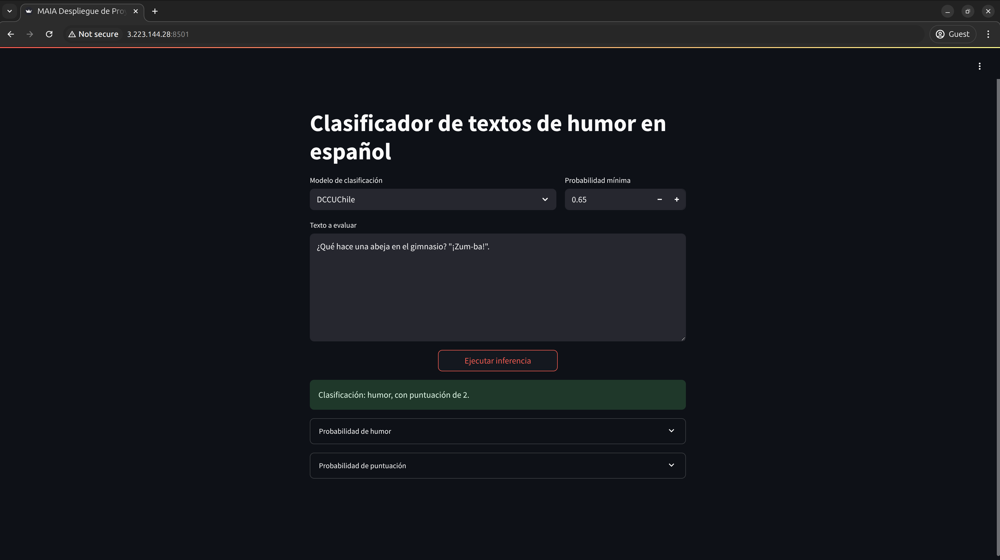
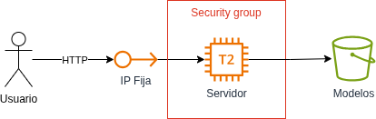

# Detección de humor en textos en español: Un enfoque de aprendizaje profundo para el contexto latinoamericano

## Integrantes

Maestría en Inteligencia Artificial – Universidad de los Andes,
Colombia.

- Oscar Julián Castañeda Gutiérrez <oj.castaneda@uniandes.edu.co>
- Oscar Javier Bachiller Sandoval <oscarbachiller@uniandes.edu.co>
- Danny Zamorano Vallejo <d.zmorano@uniandes.edu.co>
- Luis Carlos Rodríguez Barrios <lc.rodriguezb1@uniandes.edu.co>

## Descripción del Proyecto

Este proyecto aborda la detección automática de humor en textos en español, con un enfoque en el contexto latinoamericano. Utilizamos técnicas de aprendizaje profundo basadas en Transformers, ajustadas finamente para captar elementos culturales, sociales y lingüísticos que influyen en el humor.

El repositorio permite entrenar clasificadores de textos con detección binaria y multiclase de humor, usando modelos preentrenados disponibles en Hugging Face o Google AI. Adicionalmente, cuenta con una aplicación lista para desplegar, que permite utilizar los modelos con textos nuevos a través de una interfaz sencilla.

---

## Organización del Repositorio

- `notebooks/`: cuadernos Jupyter con análisis exploratorio y generación de datos.  
- `dashboard/`: scripts para desplegar la aplicación de inferencia con los modelos evaluados.  
- `data/`:  
  - `raw/`: datos originales extraídos de múltiples fuentes.  
  - `processed/`: datos procesados en formato adecuado para los modelos y datos adicionales generados internamente.  
  - `classification/`: datos etiquetados para tareas de clasificación de humor.  
  - `detection/`: datos etiquetados para detección binaria de humor y pruebas de estrés.  
- `experiments/`: archivos de entrenamiento/evaluación con las configuraciones finales utilizadas.  
- `humor-detection/`: librería con utilidades para análisis de datos, manipulación de datos, adaptación de modelos preentrenados, entrenamiento de modelos, evaluación y predicción.  
- `train_logs/`: registros graficados con valores de evaluación finales.  
- `test_mlruns.tar.gz`: registros de métricas de evaluación finales en MLflow.

---

## Instrucciones de uso

### API de entrenamiento

1. Clonar el repositorio:
    - `git clone https://github.com/usuario/repositorio-humor.git`

2. Instalar la librería (recomendado en un entorno virtual):
    - `pip install ./humor-detection`

3. Ejecutar cualquier archivo de la carpeta `experiments` con uno de los siguientes argumentos: `classification`, `detection`, `train_classification` o `train_detection`, según el archivo seleccionado:
    - `python ./experiments/dccuchile.py classification`

---

## Enlaces Relevantes

### Repositorio con modelos ajustados

- [ojcastaneda/spanish-humor-detection](https://huggingface.co/ojcastaneda/spanish-humor-detection)

### Modelos preentrenados usados  

- [bigscience/bloom-1b1](https://huggingface.co/bigscience/bloom-1b1)
- [google/canine-c](https://huggingface.co/google/canine-c)
- [dccuchile/bert-base-spanish-wwm-cased](https://huggingface.co/dccuchile/bert-base-spanish-wwm-cased)
- [deepseek-ai/DeepSeek-R1-Distill-Qwen-1.5B](https://huggingface.co/deepseek-ai/DeepSeek-R1-Distill-Qwen-1.5B)
- [distilbert/distilbert-base-multilingual-cased](https://huggingface.co/distilbert/distilbert-base-multilingual-cased)
- [distilbert/distilgpt2](https://huggingface.co/distilbert/distilgpt2)
- [gemini-2.0-flash](https://ai.google.dev/gemini-api/docs/models?hl=es-419&authuser=3#gemini-2.0-flash)
- [lxyuan/distilbert-base-multilingual-cased-sentiments-student](https://huggingface.co/lxyuan/distilbert-base-multilingual-cased-sentiments-student)
- [textdetox/xlmr-large-toxicity-classifier](https://huggingface.co/textdetox/xlmr-large-toxicity-classifier)

### Datasets utilizados  

- [HAHA 2019](https://www.kaggle.com/datasets/bachrr/haha-2019/data)
- [CHISTES_spanish_jokes](https://huggingface.co/datasets/mrm8488/CHISTES_spanish_jokes)
- [stupidstuff.org](https://github.com/taivop/joke-dataset)

## Despliegue

Se disponibilizó una apliación sencilla desarrollada con streamlit para poder utilizar los modelos que fueron entrenados y evaluados en este trabajo.



La aplicación permite seleccionar el modelo, opcionalmente un umbral de detección, e incluye una entrada de texto con a ser evaluada por el modelo seleccionado.

Para acceder a la misma diríjase a:

[http://3.223.144.28:8501/](http://3.223.144.28:8501/)

### Infrastructura

La aplicación fue desplegada en AWS, con una instancia de EC2 detrás de una Elastic IP con la cual podemos conservar la dirección IP de la instancia al iniciarla y apagarla.

Se utilizó una AMI de Ubuntu con una instancia t2.xlarge debido a los requerimientos de memoria de los modelos.

Adicionalmente, los modelos entrenados se cargan al servidor a través de S3.



> [!NOTE]
> La infraestrura será eliminada de forma permanente luego de la evaluación

### Configuración del servicio

Una vez creada la infrastructura descrita, se configura la aplicación como un servicio en la instancia de EC2 se llevó a cabo con los siguientes pasos.

1. Clonar el repositorio:

    ```sh
    git clone https://github.com/ojcastaneda/spanish-humor-detection.git
    cd spanish-humor-detection
    ```

2. Cargar modelos:

    ```sh
    aws s3 cp --recursive s3://maia-humor-detection tuned_models
    ```

3. Creación del entorno virtual e instalación de dependencias:

    ```sh
    python3 -m venv .venv
    source .venv/bin/activate
    cd dashboard
    pip install -r requirements.txt
    ```

4. Configuración del servicio:

    Se crea el archivo de configuración del servicio en `/etc/systemd/system/streamlit.service` con el siguiente contenido:

    ```ini
    [Unit]
    Description=Streamlit App
    After=network.target

    [Service]
    User=ubuntu
    WorkingDirectory=/home/ubuntu/spanish-humor-detection
    ExecStart=/home/ubuntu/spanish-humor-detection/.venv/bin/streamlit run dashboard/app.py
    Restart=on-failure
    RestartSec=5

    [Install]
    WantedBy=multi-user.target
    ```

    Se habilita y se inicia el servicio:

    ```sh
    sudo systemctl enable streamlit.service
    sudo systemctl start streamlit.service
    ```

    Para conocer el estado del servicio, se utiliza el siguiente comando:

    ```sh
    sudo systemctl status streamlit.service
    ```

    Por ultimo, para ver logs del servicio:

    ```sh
    sudo journalctl -u streamlit.service -f
    ```